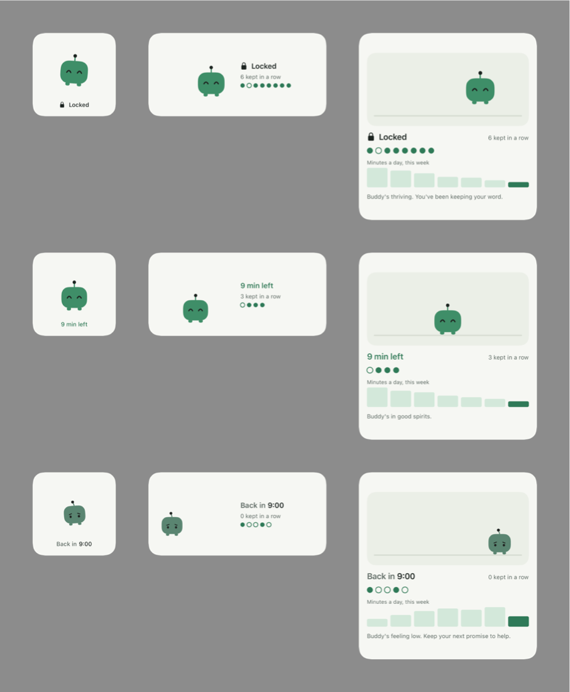

# Accountable

**A fun, interactive way to take your time back from social media.**

## Why I'm building this

I watched social media take over my life, and the lives of the people around me. "Five minutes" of scrolling would turn into an hour, then a whole evening, then a habit nobody really chose. The apps are built to keep you there, and the usual fixes didn't help: a daily screen time limit is easy to ignore with one tap, and deleting the apps never lasted.

I wanted something that works *with* how people actually are. It shouldn't lecture you or shame you. It should hold you to the promise you make to yourself, and make keeping that promise feel good. So I built Accountable to hold me accountable, and my friends too.

## The idea

Before you open TikTok or Instagram, Accountable asks one question: **"How long do you want?"**

- Your apps stay **locked by default**. To use them, you say how long, and you mean it.
- They unlock for **exactly that long**, then lock again when the time's up.
- Run out of time and you take a short break before the next session. Keep running out and the breaks get longer.
- **Buddy**, a small green robot, keeps you company. Keep your promises and Buddy thrives, hopping around and growing. Break them and Buddy gets smaller and sadder. The only way to cheer Buddy up is to keep your word.

Deciding in advance, instead of scrolling until you notice, is the whole point. Research shows it works.

## How it works

1. **See what's at stake.** A short intro walks through what the research says, then asks how much time you spend on social media. It shows how many years of your life that adds up to, and how many you could win back.
2. **Pick your apps.** Choose the apps that pull you in, using Apple's Screen Time picker.
3. **Say how long, every time.** 5, 10, 15, 30 minutes, or your own number. Only time actually spent in those apps counts.
4. **Keep your word.** When the time's up, the apps lock. A notification lets you know a minute before.
5. **Watch yourself improve.** Promises kept in a row, your last ten promises, and minutes per day this week. There's no permanent score: a good run always wins back a bad stretch.
6. **Your time.** Once you have a few days of data, the lifetime projection updates with your real average, so you can watch the years you're winning back grow.
7. **Unwind.** When you feel the pull, or while you wait out a break: guided breathing, a quick grounding exercise, and ideas for something better to do.
8. **Buddy on your Home Screen.** Widgets in three sizes where Buddy hops around, blinks, and shows how you're doing. Tap Buddy to make him jump.

## The research behind it

- **Less scrolling, less lonely.** University of Pennsylvania students who limited social media to about 30 minutes a day felt significantly less lonely and depressed within three weeks. *Hunt et al., Journal of Social and Clinical Psychology, 2018.*
- **An hour back, every day.** People paid to deactivate Facebook for four weeks freed up about 60 minutes a day, spent more time offline with friends and family, and reported small but significant gains in well-being. *Allcott et al., American Economic Review, 2020.*
- **Deciding ahead works.** Across 94 studies, planning exactly when and how you'll act had a medium-to-large effect on reaching goals. *Gollwitzer & Sheeran, Advances in Experimental Social Psychology, 2006.*
- **Breathing helps.** Five minutes a day of cyclic sighing improved mood and lowered stress more than mindfulness meditation. *Balban et al., Cell Reports Medicine, 2023.*
- Lifetime projections use remaining life expectancy by age from the *CDC/NCHS United States Life Tables, 2023*.

## Privacy

- **Everything stays on your phone.** No accounts, no servers, no analytics.
- **We can't see your apps.** Apple's Screen Time gives Accountable anonymous tokens, not app names, and nothing about what you do inside them.

## Research study mode

Accountable is also being used in a separate 4-week University of Florida study comparing fixed-length breaks with breaks that grow longer. The study runs independently of the app; regular users never see it, and nothing is logged for them.

A researcher enables study mode from a hidden screen by entering a participant ID and group. The participant then sees a consent screen, and only after they agree does the app keep a local log. The log records sessions, limits and breaks, never app names or content, and it leaves the phone only if the participant exports it as a CSV.

## Built with

Swift and SwiftUI. No third-party packages.

| Target | Role |
|---|---|
| `Accountable` | The app: intro, app picker, "How long?" flow, home, Your time, Unwind, settings, study mode |
| `AccountableMonitor` | `DeviceActivityMonitor` extension: re-locks apps when a session's time is used up |
| `AccountableShield` | `ShieldConfiguration` extension: the custom lock screen |
| `AccountableShieldAction` | `ShieldAction` extension: handles taps on the lock screen buttons |
| `AccountableWidget` | WidgetKit extension: Buddy widgets |

`Shared/` is compiled into every target; `SharedUI/` (theme, Buddy, widget layouts) into the app and the widget. Targets share state through an App Group.

**Apple frameworks:** [FamilyControls](https://developer.apple.com/documentation/familycontrols), [ManagedSettings](https://developer.apple.com/documentation/managedsettings), [DeviceActivity](https://developer.apple.com/documentation/deviceactivity), [WidgetKit](https://developer.apple.com/documentation/widgetkit).

### Platform notes

- Screen Time schedules must be at least 15 minutes, so a session's limit is a usage threshold inside a longer window. Short sessions and breaks still work.
- Opening Accountable straight from the lock screen needs iOS 26.5 or later; earlier versions get a notification instead.
- Widgets can't run their own animations, and in testing iOS showed widget frames as still pictures about once a second. So Buddy moves like stop-motion: short bouncy hops, each frame a clear pose (in the air with speed lines and a shrinking shadow, or landing with a squash and dust puffs). A few minutes of movement are planned after each refresh; iOS pre-draws every frame, so longer plans made it fall back to a placeholder.
- Screen Time doesn't work in the iOS Simulator. There the app runs a **demo mode** with pretend apps and a fast clock (1 minute = 2 seconds), so every screen can be tried.

## Running it

**Requirements:** iOS 17+, Xcode 26.3+, an iPhone, and a paid Apple Developer account (free Personal Teams can't use Family Controls on a device).

1. Clone the repo and open `Accountable.xcodeproj`.
2. For each target, open **Signing & Capabilities** and choose your team.
3. Turn on Developer Mode on your iPhone (Settings → Privacy & Security), then run the `Accountable` scheme.

Or just press Run with a Simulator selected to try the demo. See [docs/TESTING.md](docs/TESTING.md) for a full test checklist.

## Status

The app is feature-complete, and every screen has been tested in the Simulator. Next up is testing on a real iPhone: the Screen Time locking, usage tracking and lock screen only work there.

## Author

William Evans, University of Florida
